

# Flower JO

**Online stores for flower shops that sell on WhatsApp and Instagram.** 
One codebase and one database serve every shop. A new shop is a database row plus a DNS record.

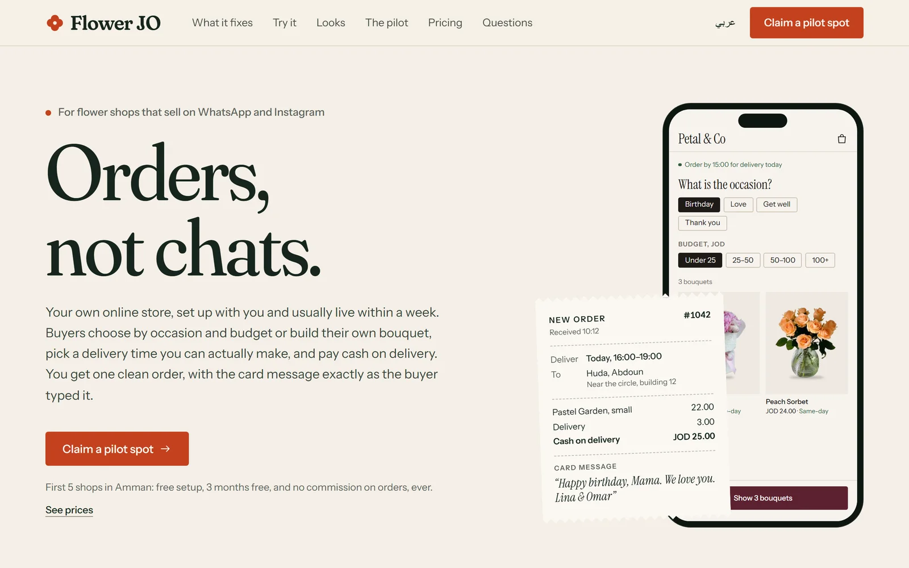

Flower JO gives each flower shop a mobile-first store of its own: a home page that starts from the card ("What do you want to say?"), an occasion-based finder, a custom bouquet and box builder with live pricing, slot-based same-day delivery, a page of its own for whoever receives the gift, and a phone-friendly owner dashboard. The bare domain shows the landing page above, which collects pilot requests from shop owners.

## The storefront

Each shop picks one of three templates in Store settings. Products, cart and checkout are shared, so one checkout stays correct for every look. Every screen is in English and Arabic with full right-to-left layout.

<table>
  <tr>
    <td align="center">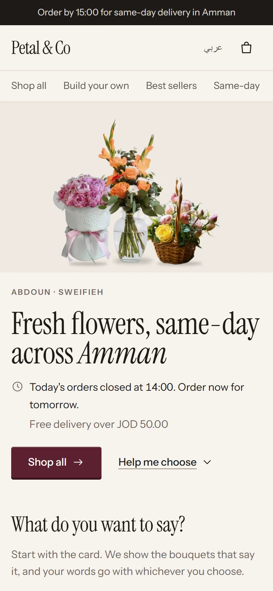</td>
    <td align="center">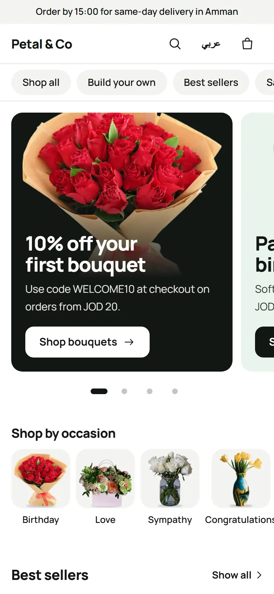</td>
    <td align="center">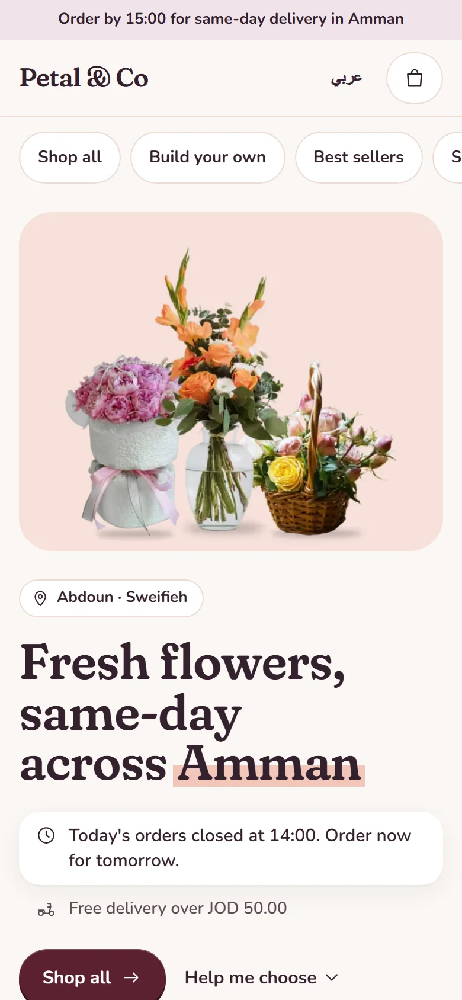</td>
    <td align="center">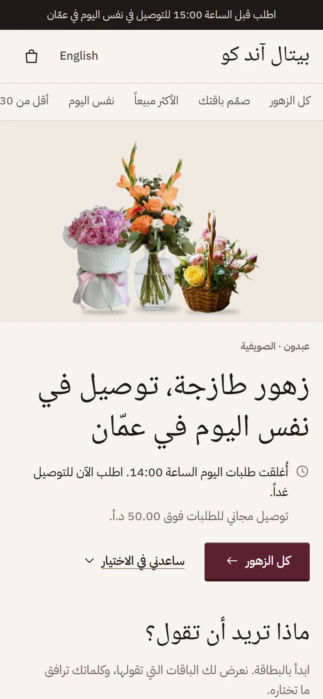</td>
  </tr>
  <tr>
    <td align="center"><b>Editorial</b> printed lookbook</td>
    <td align="center"><b>Market</b> practical, opens on promotions</td>
    <td align="center"><b>Posy</b> soft pastel gift boutique</td>
    <td align="center"><b>Arabic</b> full RTL</td>
  </tr>
</table>

## How an order flows

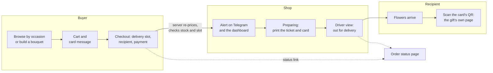
```mermaid
flowchart LR
  subgraph Buyer
    A["Browse by occasion<br>or build a bouquet"] --> B["Cart and<br>card message"]
    B --> C["Checkout: delivery slot,<br>recipient, payment"]
  end
  subgraph Shop
    D["Alert on Telegram<br>and the dashboard"] --> E["Preparing:<br>print the ticket and card"]
    E --> F["Driver view:<br>out for delivery"]
  end
  subgraph Recipient
    G["Flowers arrive"] --> H["Scan the card's QR:<br>the gift's own page"]
  end
  C -->|"server re-prices,<br>checks stock and slot"| D
  F --> G
  C -.->|status link| S["Order status page"]
  F -.-> S
```

**1. The buyer orders from their phone.** No account, only a phone number. They pick an arrangement or build one stem by stem, write the card, choose a delivery slot the shop can actually make, and pay cash on delivery or by bank transfer (CliQ), uploading the receipt on their order page.

<table>
  <tr>
    <td align="center">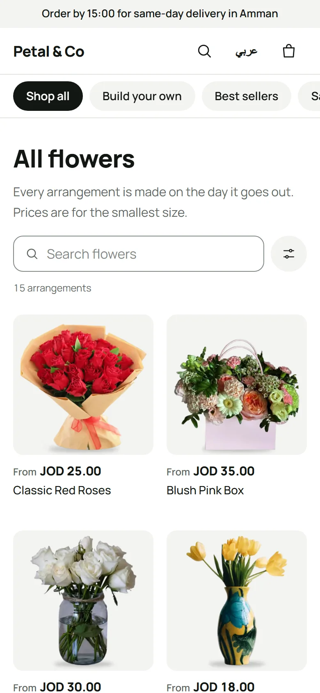</td>
    <td align="center">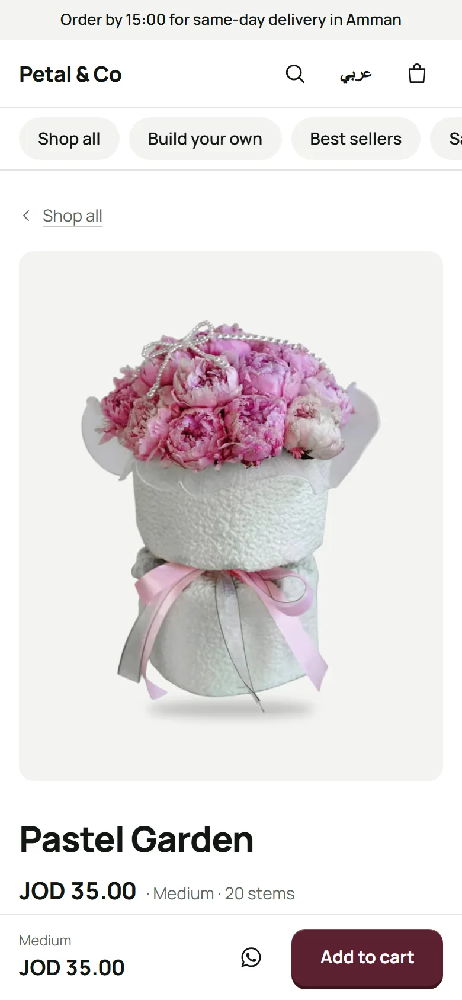</td>
    <td align="center">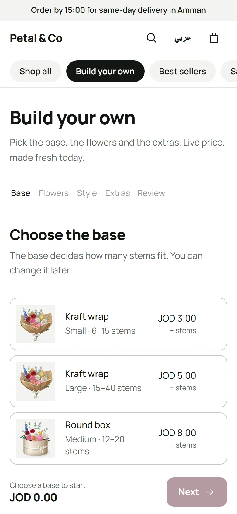</td>
    <td align="center">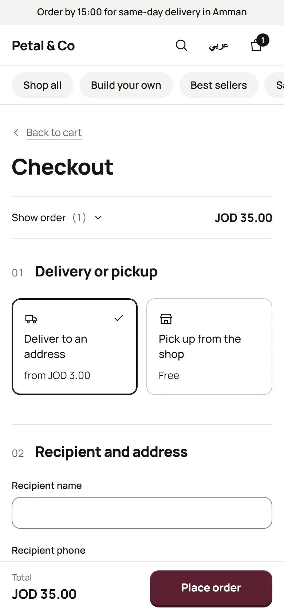</td>
  </tr>
  <tr>
    <td align="center">Catalog and finder</td>
    <td align="center">Product, with sizes</td>
    <td align="center">Build your own</td>
    <td align="center">Checkout</td>
  </tr>
</table>

**2. The shop gets one clean order.** It arrives on Telegram and in the dashboard with the card message exactly as typed. Staff move it through New → Preparing → Out → Delivered, message the buyer on WhatsApp with ready-made text, and print an A5 ticket with a QR code for the card.

<table>
  <tr>
    <td align="center">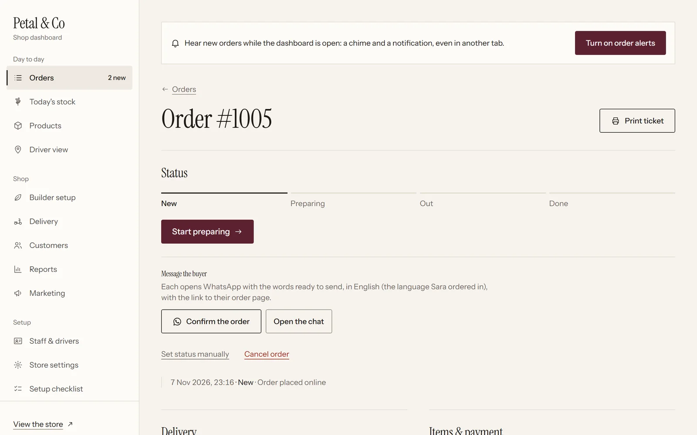</td>
    <td align="center">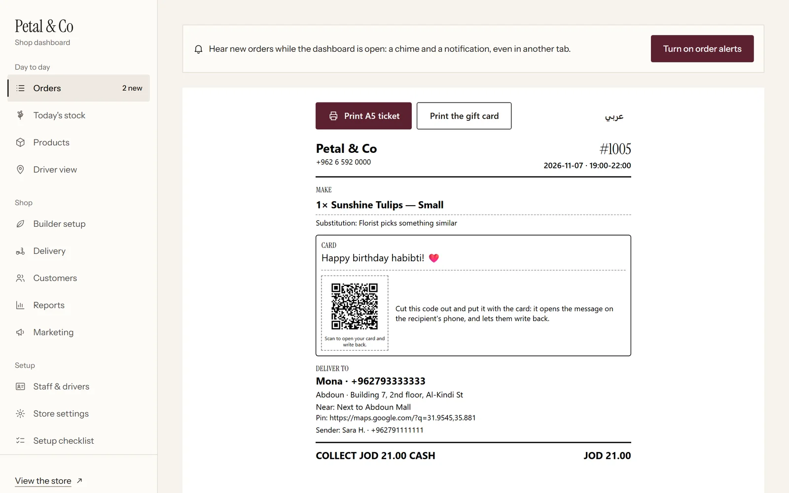</td>
  </tr>
  <tr>
    <td align="center">One order: status, buyer messages, delivery</td>
    <td align="center">The printed ticket and gift card QR</td>
  </tr>
</table>

**3. The driver delivers, the buyer follows along, the recipient opens the card.** The driver's view lists the day's stops in slot order with call and map buttons. The buyer's status link updates at each step. The recipient gets a page with the message and care notes, and no prices.

<table>
  <tr>
    <td align="center">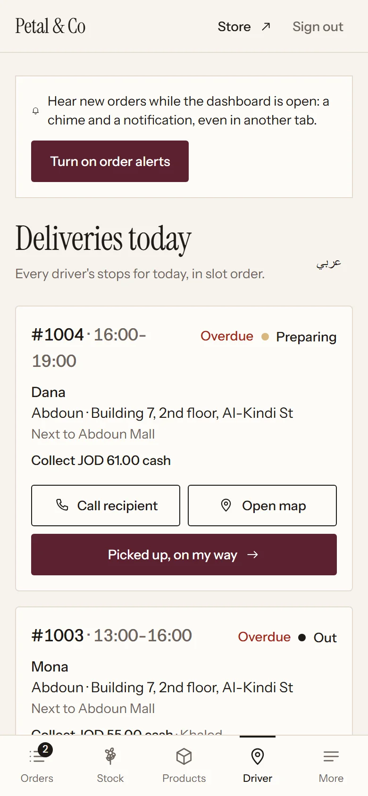</td>
    <td align="center">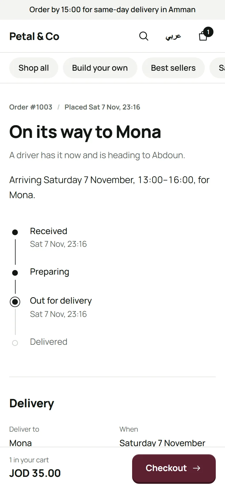</td>
    <td align="center">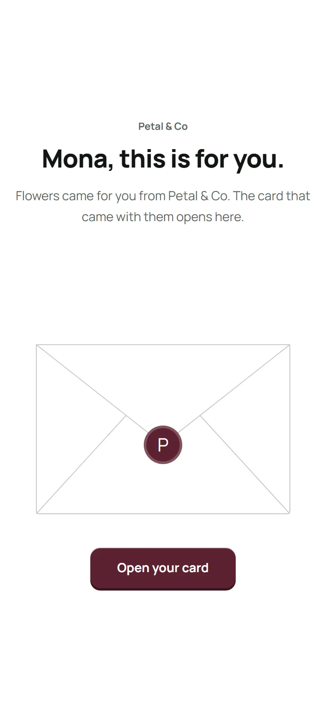</td>
    <td align="center">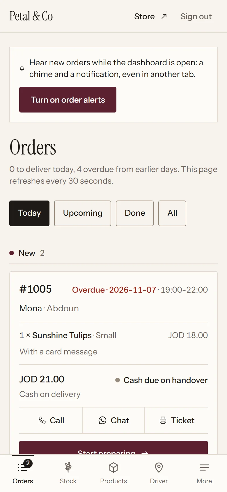</td>
  </tr>
  <tr>
    <td align="center">Driver view</td>
    <td align="center">Buyer's order status</td>
    <td align="center">Recipient's gift page</td>
    <td align="center">Orders on the owner's phone</td>
  </tr>
</table>

## The owner dashboard

Orders, today's stem stock, products, the builder's bases and prices, delivery zones and cut-offs, customers, reports, promotions, staff and a guided setup checklist. It works on a phone as well as a desktop.

<table>
  <tr>
    <td align="center">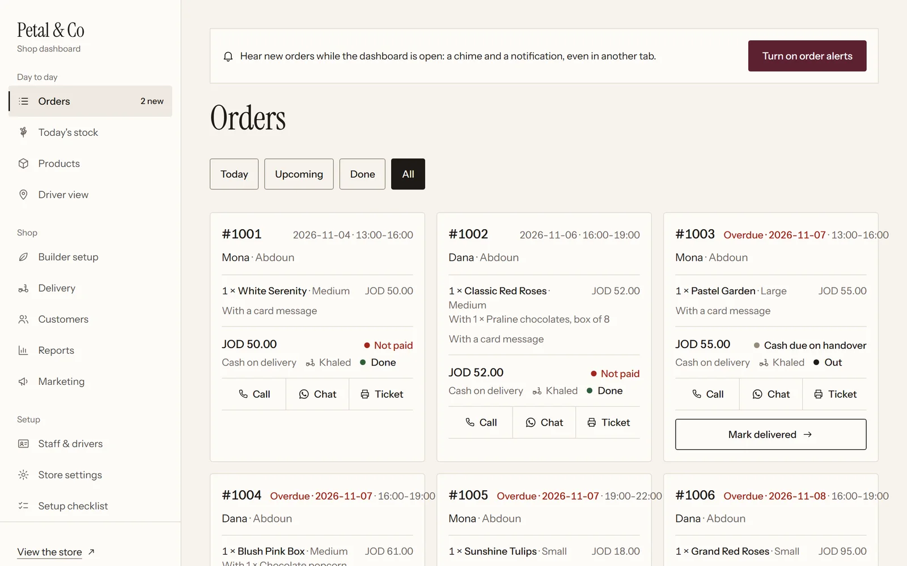</td>
    <td align="center">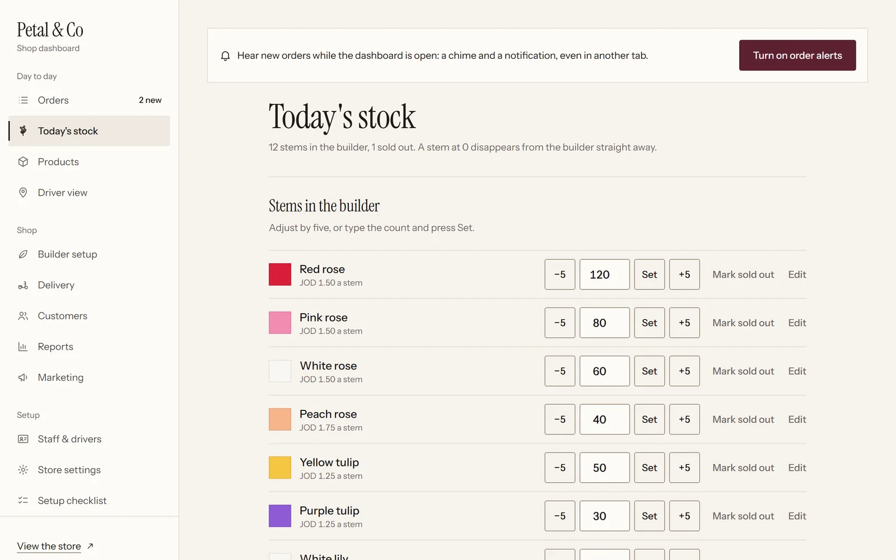</td>
  </tr>
  <tr>
    <td align="center">Orders</td>
    <td align="center">Today's stock: a stem at 0 leaves the builder at once</td>
  </tr>
  <tr>
    <td align="center">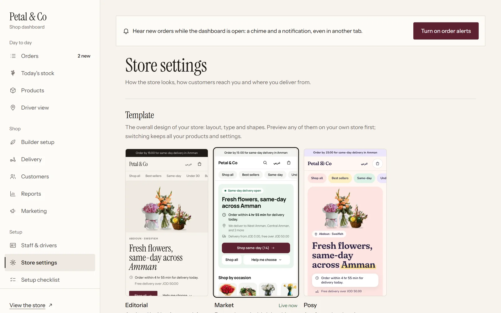</td>
    <td align="center">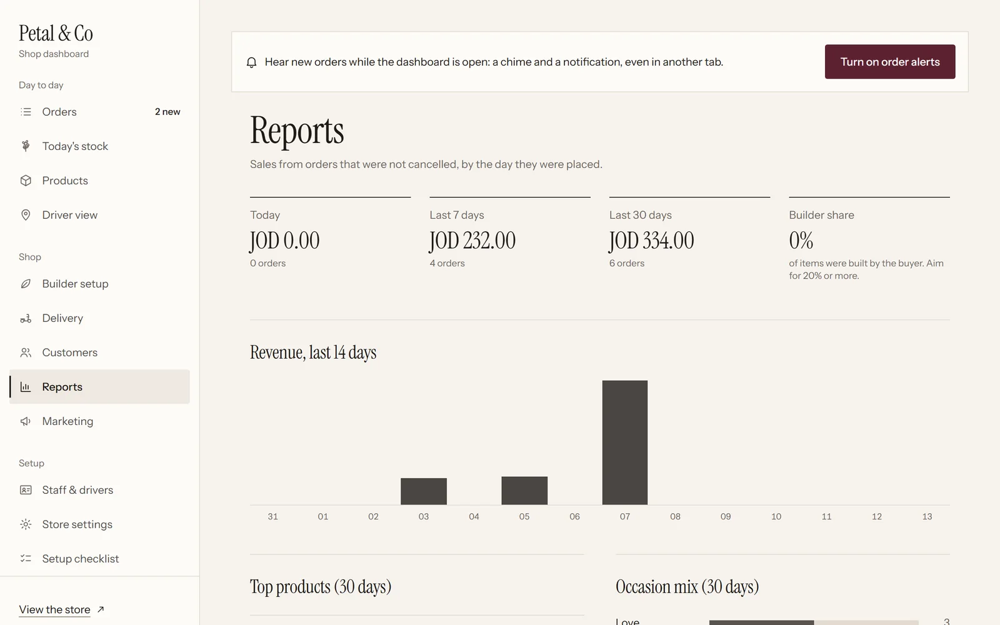</td>
  </tr>
  <tr>
    <td align="center">Store settings: preview and switch templates</td>
    <td align="center">Reports</td>
  </tr>
</table>

## Architecture

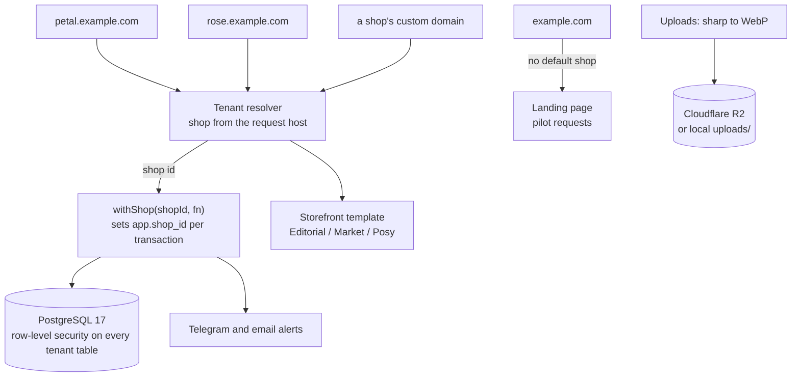
```mermaid
flowchart TB
  U1["petal.example.com"] --> T
  U2["rose.example.com"] --> T
  U3["a shop's custom domain"] --> T
  U0["example.com"] -->|no default shop| L["Landing page<br>pilot requests"]
  T["Tenant resolver<br>shop from the request host"] -->|shop id| W["withShop(shopId, fn)<br>sets app.shop_id per transaction"]
  W --> P[("PostgreSQL 17<br>row-level security on every tenant table")]
  T --> R["Storefront template<br>Editorial / Market / Posy"]
  W --> N["Telegram and email alerts"]
  IMG["Uploads: sharp to WebP"] --> R2[("Cloudflare R2<br>or local uploads/")]
```

The shop is resolved from the request host, and Postgres enforces the tenant boundary a second time, independently of application code. A bug that forgets a filter still cannot read another shop's rows.

## What it does

**For buyers**

- Start from the card: type what you want to say and the store suggests bouquets for the occasion.
- Find by occasion and budget, or build a bouquet or box stem by stem with a live price.
- Delivery slots that respect the shop's capacity and same-day cut-off.
- No account: a phone number, then a private link to follow the order.
- English and Arabic, with full right-to-left layout.

**For whoever receives the flowers**

- A page of their own, opened from the QR code on the card: the message, what the flowers mean and how to care for them. No prices, no phone numbers.

**For the shop**

- New orders on Telegram and in a dashboard that works on a phone.
- Ready-made WhatsApp messages to the buyer at each step.
- A printable A5 ticket and gift card for every order.
- Today's stem stock: a stem at zero leaves the builder at once.
- Delivery zones, fees, slots and peak-day rules for Valentine's and Mother's Day.
- Three storefront templates, previewed on the live store before switching.
- Promotions, discount codes, customers, reports, staff and driver roles.

## Stack

| Layer | Choice |
| --- | --- |
| App | Next.js 16 (App Router, server actions), React 19, TypeScript |
| Styling | Tailwind CSS 4, three storefront templates built on design tokens, per-shop brand colours |
| Database | PostgreSQL 17 via Prisma 7, row-level security per shop |
| Auth | Staff: email and password session. Buyers: no accounts, phone number only |
| Images | Uploads resized to WebP with sharp, stored in Cloudflare R2 |
| i18n | English and Arabic with full RTL, per-record Arabic fields |
| Hosting | Docker behind a Cloudflare Tunnel, nightly database backups |
| Quality | Lint, type-check, unit tests and tenant-isolation tests against a real Postgres in CI |

## About this repository

This is a showcase. The source code lives in a private repository. Screenshots show demo shops and demo data.
